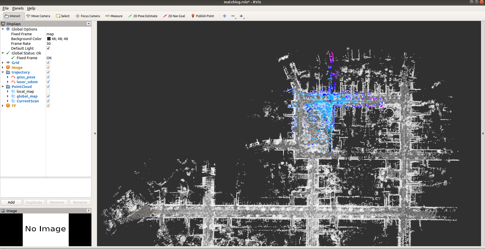

---

## 本地环境配置和构建

ubuntu 18.04 melodic 
---
* 安装g2o和GeographicLib
* 配置本地Protobuf环境
修改lidar_localization/cmake对应.cmake文件，链接到库。

* 打开lidar_localization/config/scan_context文件夹，输入如下命令，生成pb文件
```bash
protoc --cpp_out=./ key_frames.proto
protoc --cpp_out=./ ring_keys.proto
protoc --cpp_out=./ scan_contexts.proto
mv key_frames.pb.cc key_frames.pb.cpp
mv ring_keys.pb.cc ring_keys.pb.cpp
mv scan_contexts.pb.cc scan_contexts.pb.cpp
```
分别修改生成的三个.pb.cpp文件。如下，以ring_keys.pb.cpp为例。
```C++
// Generated by the protocol buffer compiler.  DO NOT EDIT!
// source: ring_keys.proto

#define INTERNAL_SUPPRESS_PROTOBUF_FIELD_DEPRECATION
#include "ring_keys.pb.h" 替换为  #include "lidar_localization/models/scan_context_manager/ring_keys.pb.h"

#include <algorithm>
```

之后，用以上步骤生成的的.pb.h文件替换lidar_localization/include/lidar_localization/models/scan_context_manager
中的同名文件。
将.pb.cpp文件替换lidar_localization/src/models/scan_context_manager中的同名文件。

 * 编译catkin_workspace,注意是catkin build

```bash
# build
catkin config --install && catkin build
```
**启动解决方案**

```bash
# set up session:
source install/setup.bash
# launch mapping:
roslaunch lidar_localization mapping.launch
```

```bash
# play ROS bag, lidar-only KITTI:
rosbag play r -0.2 kitti_lidar_only_2011_10_03_drive_0027_synced.bag #减慢播放速度
```

**运行过程中保存地图与Loop Closure Data**

```bash
# set up session:
source install/setup.bash
# force backend optimization:
rosservice call /optimize_map
# save optimized map:
rosservice call /save_map 
# if you still use refence Scan Context Loop Closure implementation, execute this command.
rosservice call /save_scan_context 
```
---
##  跑通建图流程、保存地图，并截图显示完整地图
---


---
## 在建图的基础上，加载点云地图，实现在地图原点的初始化
---


---
## 在建图的基础上，实现全局初始化的要求
---
保存的.pcd文件处于lidar_localization/slam_data中,保存的filtered_map.pcd不是完整地图。
matching采用scancontext，不同时间点的初始化:
```bash
rosbag play -r 0.2 kitti_lidar_only_2011_10_03_drive_0027_synced.bag -s 100 #第100s
```
100S时初始化

200S时初始化

300S时初始化

400S时初始化


* 采用SetGNSSPose方式，除开原点，其他时间点是matching错误的。比如在100s时：

